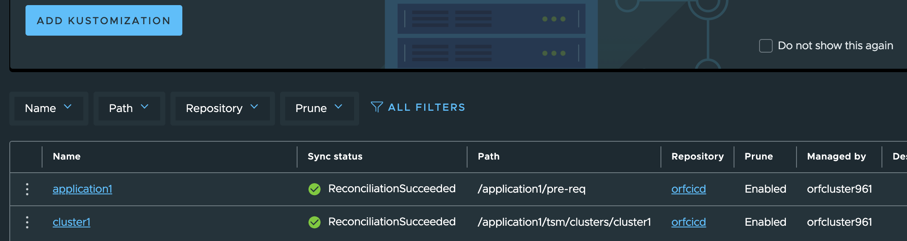
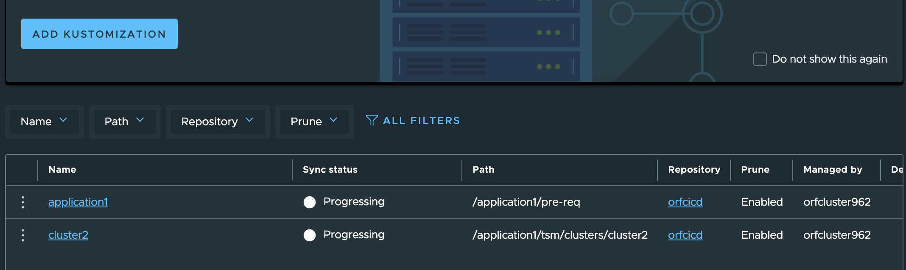
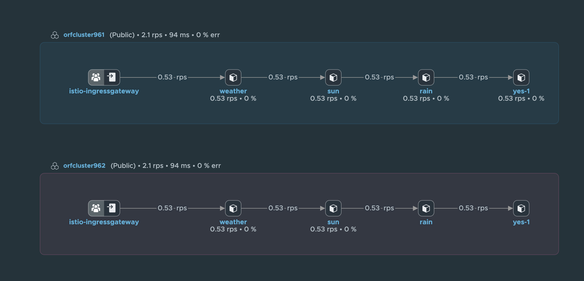
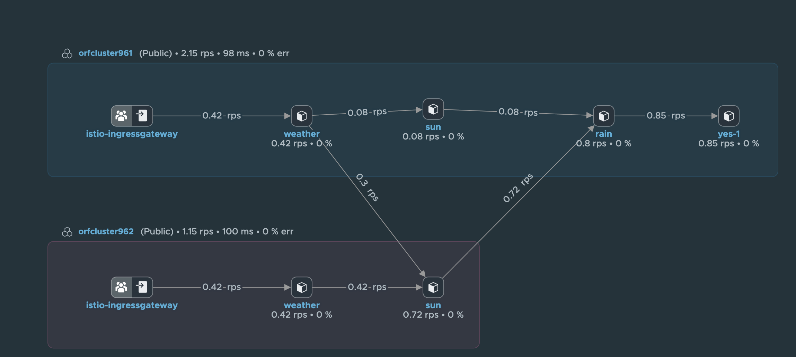
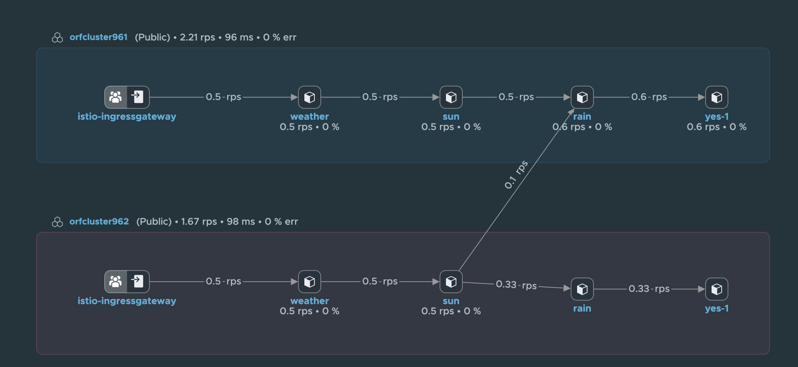

# TMC integration

```
1) Create cluster 1 control/3 worker best-effort-med/best-effort large (2 CPU/8 GB RAM)/(4 CPU/16 GB RAM)
2) Enable Cluster (button => FluxCD will be installed on cluster) 
3) Clusters -> {cluster name} -> Add-ons -> Git Repositories -> Add Git Repository -> Name= orfcicd, URL = https://github.com/ogelbric/cicd.git,  Brach = main
4) Continuous Delivery -> Kustomizations -> application1 -> Path = /application1/pre-req, Prune = On
```


# To check on deployment in cluster: 
```
kubectl get kustomizations -A
```
```
NAMESPACE                            NAME              AGE   READY   STATUS
tanzu-continuousdelivery-resources   application1      43h   True    Applied revision: main/7d54a879444ebebb29eb09c4cb9f1a8e95f15498
tanzu-continuousdelivery-resources   tanzu-app         70m   True    Applied revision: main/7d54a879444ebebb29eb09c4cb9f1a8e95f15498
tanzu-continuousdelivery-resources   tanzu-auth        70m   True    Applied revision: main/7d54a879444ebebb29eb09c4cb9f1a8e95f15498
tanzu-continuousdelivery-resources   tanzu-namespace   70m   True    Applied revision: main/7d54a879444ebebb29eb09c4cb9f1a8e95f15498
```
```
kubectl get svc -norfns
```
```
NAME    TYPE           CLUSTER-IP     EXTERNAL-IP     PORT(S)        AGE
nginx   LoadBalancer   10.96.61.129   192.168.2.104   80:30931/TCP   18m
```
```
kubectl get deployments -n orfns
```
```
NAME    READY   UP-TO-DATE   AVAILABLE   AGE
nginx   4/4     4            4           18m
```
```
kubectl get pods -n orfns
```
```
NAME                     READY   STATUS    RESTARTS   AGE
nginx-54f4568dfc-f5vcf   1/1     Running   0          18m
nginx-54f4568dfc-kxr2g   1/1     Running   0          18m
nginx-54f4568dfc-lgclv   1/1     Running   0          18m
nginx-54f4568dfc-lhfw4   1/1     Running   0          18m
```

# TSM yaml's

```
POD flow: weather -> sun -> rain -> yes
```
# TMC integration

```
On Cluster 1
4) Continuous Delivery -> Kustomizations -> cluster1 -> Path = /application1/tsm/clusters/cluster1, Prune = On
On Cluster 2
5) Continuous Delivery -> Kustomizations -> cluster2 -> Path = /application1/tsm/clusters/cluster2, Prune = On
```





* Scaling replicas in Gitup appberlin (sun) and appparis (rain) results see pictures below 










# Trouble Shooting Commands
```
kubectl get virtualservices -A
```
```
NAMESPACE      NAME       GATEWAYS           HOSTS   AGE
orftsmberlin   rainsnow   ["acme-gateway"]   ["*"]   6m28s
orftsmparis    rainsnow   ["acme-gateway"]   ["*"]   6m27s
```
```
kubectl get gw -A
```
```
NAMESPACE      NAME           AGE
orftsmberlin   acme-gateway   9m14s
orftsmparis    acme-gateway   9m13s
```

# Test (TSM needs traffic to show the graph):

```
curl `kubectl get svc -A | grep ingressgateway | awk '{ print $5 }' | head -1`/weatherparis
curl `kubectl get svc -A | grep ingressgateway | awk '{ print $5 }' | head -1`/weatherberlin
```
```
watch -d 'curl 192.168.2.106/weatherberlin; curl 192.168.2.106/weatherparis'
watch -d 'curl 192.168.5.63/weatherberlin; curl 192.168.5.63/weatherparis'
```
